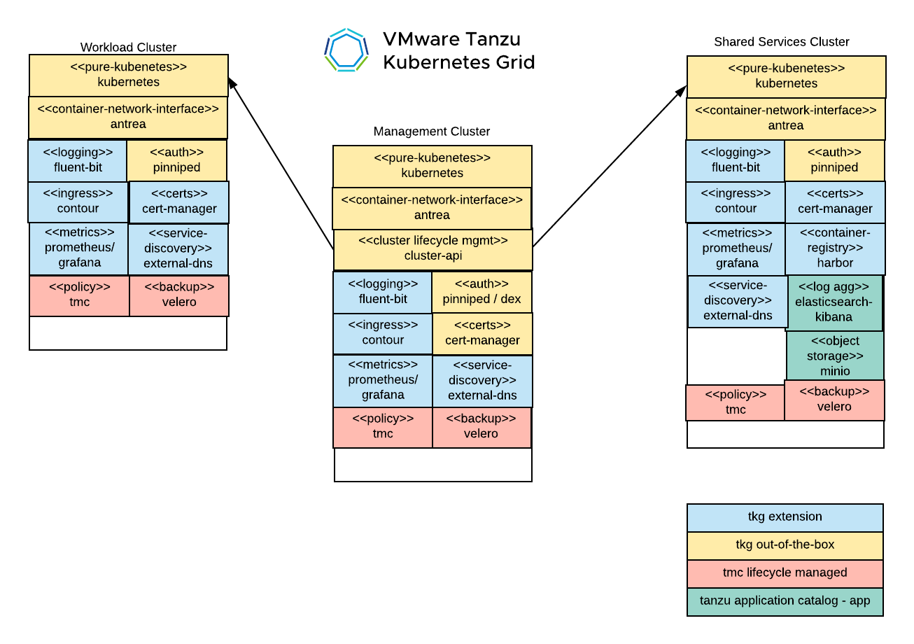
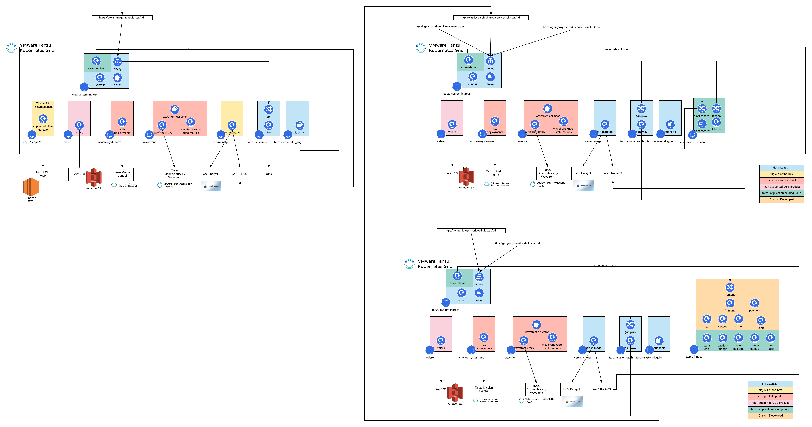

# TKG Lab

In this lab, we will deploy Tanzu Kubernetes Grid (standalone deployment model) to AWS or vSphere.  We will additionally deploy TKG extensions for ingress, authentication, and logging.

OSS Signed and Supported Extensions:

- **Contour** for ingress
- **Dex** and **Gangway** for authentication
- **Fluent-bit** for logging
- **Cert-manager** for certificate management
- **Harbor** for image registry
- **Velero** for backup, via Tanzu Mission Control

Incorporates the following Tanzu SaaS products:

- **Tanzu Mission Control** for multi-cluster management
- **Tanzu Observability** by Wavefront for observability

Leverages the following external services:

- **AWS S3** as an object store for Velero backups
- **AWS Route 53** as DNS provider
- **Okta** as an OIDC provider
- **Let's Encrypt** as Certificate Authority
- **External DNS** as Kubernetes native way to manage DNS records

## Goals and Audience

The following demo is for Tanzu field team members to see how various components of Tanzu and OSS ecosystem come together to build a modern application platform.  We will highlight two different roles of the platform team and the application team's dev ops role.  This could be delivered as a presentation and demo.  Or it could be extended to include having the audience actually deploy the full solution on their own using their cloud resources. The latter would be for SE’s and likely require a full day.

Disclaimers

- Arguably, we have products, like TAS or TKGI that deliver components of these features and more with tighter integration, automation, and enterprise readiness today.
- Additionally, it is early days in our product integrations, automation, and enterprise readiness as these products have recently entered GA or are being integrated for the first time.

What we do have is a combination of open source and proprietary components, with a bias towards providing VMware built/signed OSS components by default, with flexibility to swap components and flexible integrations.

VMware commercial products included are: TKG, TO, TMC and OSS products.

3rd-party SaaS services included are: AWS S3, AWS Route 53, GCP Cloud DNS, Let's Encrypt, Okta.  Note: There is flexibility in deployment planning.  For instance, You could Swap GCP Cloud DNS with Route53.  Or you could swap Okta for Google or Auth0 for OpenID Connect.

## Scenario Business Context

The acme corporation is looking to grow its business by improving their customer engagement channels and quickly testing various marketing and sales campaigns.  Their current business model and methods can not keep pace with this anticipated growth.  They recognize that software will play a critical role in this business transformation.  Their development and ops engineers have chosen microservices and kubernetes as foundational components to their new delivery model.  They have engaged as a partner to help them with their ambitious goals.

## App Team

The acme fitness team has reached out the platform team requesting platform services.  They have asked for:

- Kubernetes based environment to deploy their acme-fitness microservices application
- Secure ingress for customers to access their application
- Ability to access application logs in real-time as well as 30 days of history
- Ability to access application metrics as well as 90+ days of history
- Visibility into overall platform settings and policy
- Daily backups of application deployment configuration and data
- 4 Total GB RAM, 3 Total CPU Core, and 10GB disk for persistent application data

Shortly after submitting their request, the acme fitness team received an email with the following:
- Cluster name
- Namespace name
- Base domain for ingress
- Link to view overall platform data, high-level observability, and policy
- Link to login to kubernetes and retrieve kubeconfig
- Link to search and browse logs
- Link to access detailed metrics

DEMO: With this information, let’s go explore and make use of the platform…

- Access login link to retrieve kubeconfig (gangway)
- Update ingress definition based upon base domain and deploy application (acme-fitness)
- Test access to the app as and end user (convoy)
- View application logs (kibana, elastic search, fluent-bit)
- View application metrics (tanzu observability)
- View backup configuration (velero)
- Browse overall platform data, observability, and policy (tmc)

Wow, that was awesome, what happened on the other side of the request for platform services?  How did that all happen?

## Required CLIs

- kubectl
- tmc
- tkg
- velero
- helm 3
- [yq version 3.4+](https://github.com/mikefarah/yq) (to install use `brew` for Mac and `apt-get` for Linux)
- kind (helpful, but not required)
- ytt, kapp, imgpkg, kbld (bundled with tkg)

## Foundational Lab Setup Guides

There are are few options to setup the foundation lab setup of three clusters: management cluster, shared services cluster, and workload cluster.

1. [Step by Step Guide](docs/baseline-lab-setup/step-by-step.md) - Provides instructional guidance for each step, along with validation actions.  Best really learning how each cluster is setup and the extensions and integration configured for the lab.  The guidance includes options for AWS and vSphere.
2. [One Step Scripted Deployment for AWS](docs/baseline-lab-setup/one-step-aws.md) - This method assumes you have done any required manual steps.  There is one script that will deploy all clusters and perform integrations.  It is best to use this after you have already completed the step by step guide, as any specific configuration issue you may would have been worked out in that process previously.
3. [One Step Scripted Deployment for Azure](docs/baseline-lab-setup/one-step-azure.md) - This method assumes you have done any required manual steps.  There is one script that will deploy all clusters and perform integrations.  It is best to use this after you have already completed the step by step guide, as any specific configuration issue you may would have been worked out in that process previously.
4. [One Step Scripted Deployment for vSphere](docs/baseline-lab-setup/one-step-vsphere.md) - This method assumes you have done any required manual steps.  There is one script that will deploy all clusters and perform integrations.  It is best to use this after you have already completed the step by step guide, as any specific configuration issue you may would have been worked out in that process previously.

## Acme Fitness Lab

This lab will go through our simulated experience of receiving a request from an app team for cloud resources and following the steps for both the platform team receiving the request and the app team accessing and deploying their app once the request has been fulfilled.

### Platform Team Steps

#### 1. [Update Okta for Application Team Users and Group](docs/acme-fitness-lab/01_okta_setup.md)
#### 2. [Set policy on Workload Cluster and Namespace](docs/acme-fitness-lab/02_policy_acme.md)

### Switch to the App Team Perspective

#### 3. [Log-in to workload cluster and setup kubeconfig](docs/acme-fitness-lab/03-login-kubeconfig.md)
#### 4. [Get, update, and deploy Acme-fitness app](docs/acme-fitness-lab/04-deploy-app.md)

## Bonus Labs

The following labs additional labs can be run on the base lab configuration.

#### [Deploy Prometheus & Grafana for Monitoring](docs/bonus-labs/prometheus_grafana.md)
#### [Deploy Kubeapps to Shared Services Cluster](docs/bonus-labs/kubeapps.md)
#### [Deploy Gitlab to Shared Services Cluster](docs/bonus-labs/gitlab.md)
#### [Deploy Concourse to Shared Services Cluster](docs/bonus-labs/concourse.md)
#### [Wavefront Tracing with Acme-Fitness App](docs/bonus-labs/jaeger_tracing.md)
#### [Apply Image Registry Policy with TMC](docs/bonus-labs/tmc_image_policy.md)
#### [Restore Backup with Velero](docs/bonus-labs/velero_restore.md)
#### [ArgoCD w Kustomize](docs/bonus-labs/argocd-kustomize.md)
